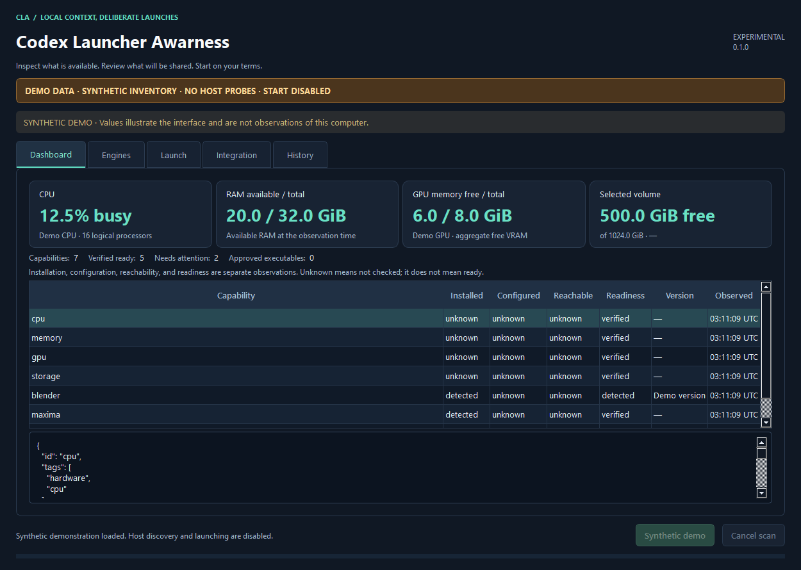

# Codex Launcher Awarness

CLA 0.1.0 is an experimental Windows application for inspecting local capabilities, preparing Codex context, and opening a Codex session in a new PowerShell 7 terminal.

The screenshot contains synthetic data only. It does not describe a real computer.

## Open the application

Run the packaged **CLA-Launcher.exe**, or use the installed source environment:

~~~powershell
python -m codex_launcher_awarness gui
~~~

To explore without inspecting the host or launching anything:

~~~powershell
python -m codex_launcher_awarness gui --demo
~~~

Demo mode has a persistent amber banner. It does not load your settings or history, probe executables, create shortcuts, apply integration, or start Codex. Its preview and screenshot are synthetic.

## First launch

1. In **Launch**, choose the project folder and select **Approve this project root**.
2. In **Engines**, select the exact **Codex CLI** and **PowerShell 7** executable paths. Candidate discovery is passive. Browse is available when an installation is absent from PATH.
3. Select **Approve selected executable paths**. Selecting a candidate alone does not authorize execution.
4. Select **Inspect inventory**. Inventory works when Codex is missing. Enable the separate bounded-probes checkbox only when you want approved programs to answer fixed capability checks.

Approvals are stored in CLA's private settings. Use **pwsh.exe** from PowerShell 7; legacy Windows PowerShell is not the launch target. Existing Codex settings are inherited by default.

## Dashboard

The four cards show sampled CPU utilization/model/core count, available/total RAM, aggregate free/total GPU memory, and free space on the selected volume. Units are explicit. Unknown observations remain unknown rather than being shown as zero. Hover over a card for its evidence ID, method, and timestamps.

The table distinguishes installation, configuration, reachability, and readiness. A file found on disk does not prove an engine works or an MCP connection is usable. Select a row for evidence, measured values, units, limitations, and errors.

Verified-ready counts include only unexpired verified records. Resource values are observations, not reservations. A freshness notice appears when evidence expires. Changing the project marks the previous snapshot as belonging to a different selection and requires a new inventory scan before launch preparation.

Inventory runs in the background. **Cancel scan**, or **Escape**, requests cancellation while preserving the last completed snapshot. The current bounded probe may need to finish. Closing CLA during a scan requests cancellation and closes after its worker returns.

## Engines

Approved paths and probe permission are separate settings. Disabling the probe checkbox returns scans to passive discovery. Approvals do not install, update, or relocate applications.

Optional settings include a trusted Conda executable and per-launch environment name, Python environment paths, and credential-free HTTP loopback origins. Conda activation happens only in the new terminal. Remote endpoint URLs are rejected.

**Save local settings** validates the form before committing it. Invalid settings leave the previous valid settings in place. These settings belong to CLA and do not edit global Codex configuration.

## Preview and launch

1. Enter the task in **Launch**.
2. Choose **general**, **coding**, **symbolic-math**, **blender**, or **gpu** to select relevant context. Optional Codex profile/model identifiers pass through only when supplied.
3. Keep **Inherit existing Codex configuration** for default permissions. The full-access choice explicitly disables Codex's sandbox and approval prompts.
4. Select **Prepare exact preview**. CLA creates a private session snapshot and displays the exact prompt it will pass to Codex. This step makes no model request and opens no terminal.
5. Review the prompt, command details, and warnings. **Export shown prompt** writes exactly that preview to the local file you select.
6. Acknowledge sharing the shown task/context with your configured Codex service, then select **Start Codex in a new PowerShell 7 terminal**.

The preview can include local paths and machine metadata. The sharing acknowledgment is required for each prepared preview. Editing the task, project, executable selection, filter, profile, model, or permission choice invalidates the preview and clears consent.

Windows administrator rights are separate from Codex sandbox choices. **Allow administrator rights for this terminal (explicit)** starts unchecked. If the desktop cannot provide a normal user launch, CLA refuses to silently inherit administrator rights. Use a normal user desktop or explicitly select the option if intended.

Repeated clicks do not create duplicate terminals for one prepared session. A failed or uncertain launch requires a new preview before retrying. Terminal creation does not prove a model response. The launch status updates as the bootstrap runs and displays startup failures or nonzero exit codes.

Closing CLA leaves launched Codex terminals running.

## Integration

Persistent MCP registration is optional. Normal CLA launches supply session-scoped integration without rewriting other Codex configuration.

In **Integration**, choose **Selected project only** or **Current user Codex MCP configuration**. **Preview integration** shows the exact target and proposed CLA-owned entry. **Apply reviewed integration** is a separate action. Changing the scope or project invalidates the plan, and the backend detects changes to the target after preview.

**Remove CLA-owned integration** removes only configuration whose CLA ownership can be verified. It preserves unrelated MCP servers and settings.

**Create CLA desktop shortcut** uses the approved PowerShell path and a fixed CLA helper. It is an explicit action and does not start Codex.

## History and private files

History displays recent CLA session metadata: session ID, timestamp when available, lifecycle status, and project. It refreshes while open and can be refreshed manually.

CLA's private application directory contains settings, immutable session evidence, prepared prompts, launch manifests, and lifecycle metadata. The History table reads status metadata only; it does not load prompt manifests or full conversations. Preparing a preview can create a history entry before a launch.

Demo mode never reads live history. Private session folders should not be published as sample data.

## Keyboard and troubleshooting

**Ctrl+R** inspects inventory, **Ctrl+L** opens Launch, and **Escape** cancels a scan. Tab navigation moves through fields and buttons. The window resizes and long forms scroll.

| Symptom | Next step |
| --- | --- |
| Start is disabled | Prepare a current preview and acknowledge sharing. Demo always disables Start. |
| Executable is not approved | Explicitly approve its exact selected path in Engines. |
| Project is not approved | Choose the folder and approve its root in Launch. |
| Project changed or evidence expired | Inspect inventory again. |
| Capability shows unknown | Read its evidence details; use an approved bounded probe if available. |
| Normal user terminal is unavailable | Use a normal user desktop or explicitly opt into administrator inheritance if intended. |
| Integration refuses to apply | Review a fresh plan; the target may have changed or may not be CLA-owned. |

Automated GUI verification does not need a model session:

~~~powershell
python -m codex_launcher_awarness gui --demo --smoke-test
python -m pytest tests/test_gui.py -q
~~~

GUI tests run offscreen with fake discovery/launch services. Screenshot export requires **--demo**; live inventory screenshot export is rejected.
